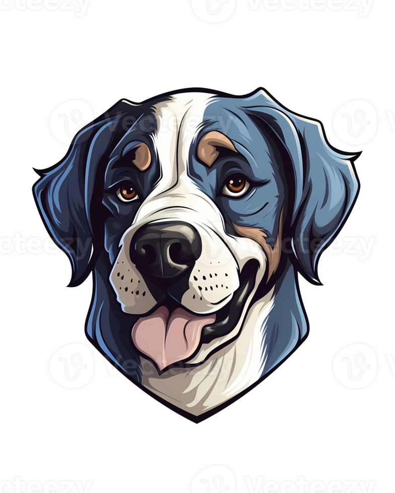
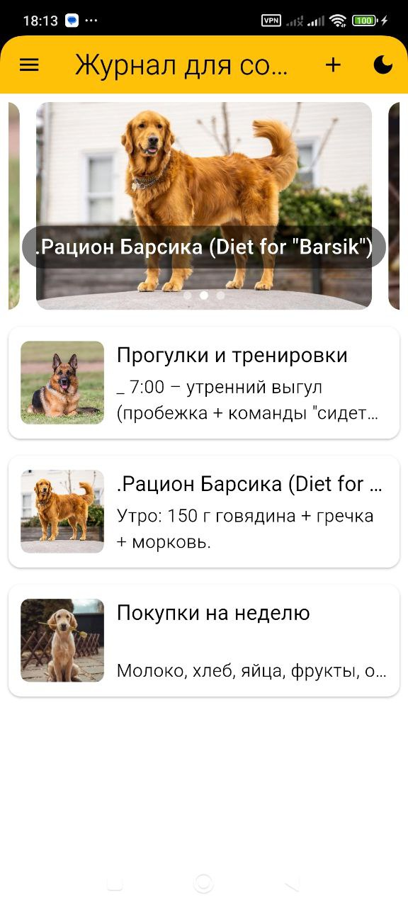
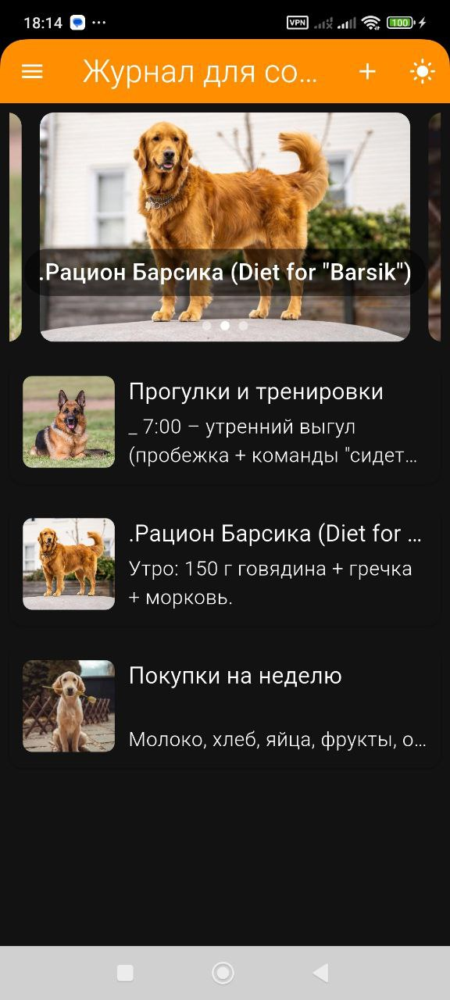
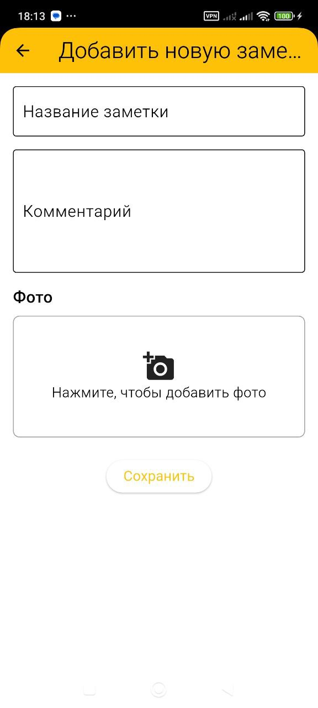
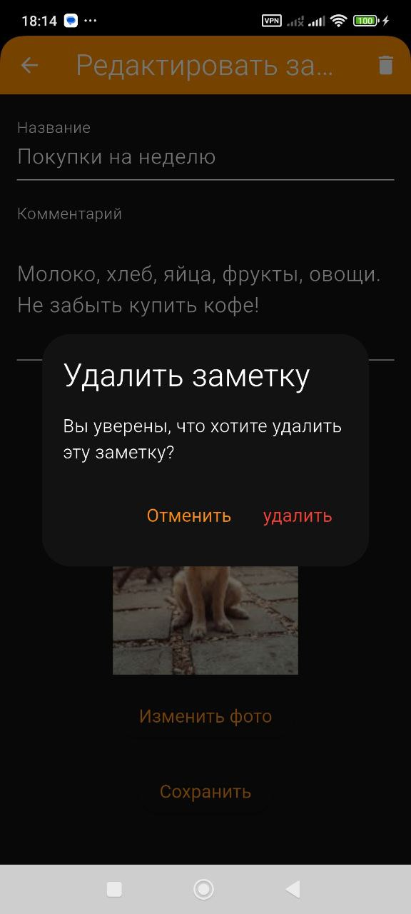
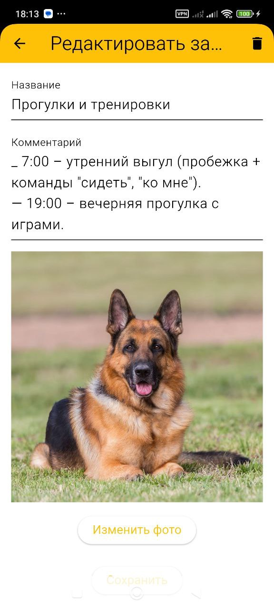
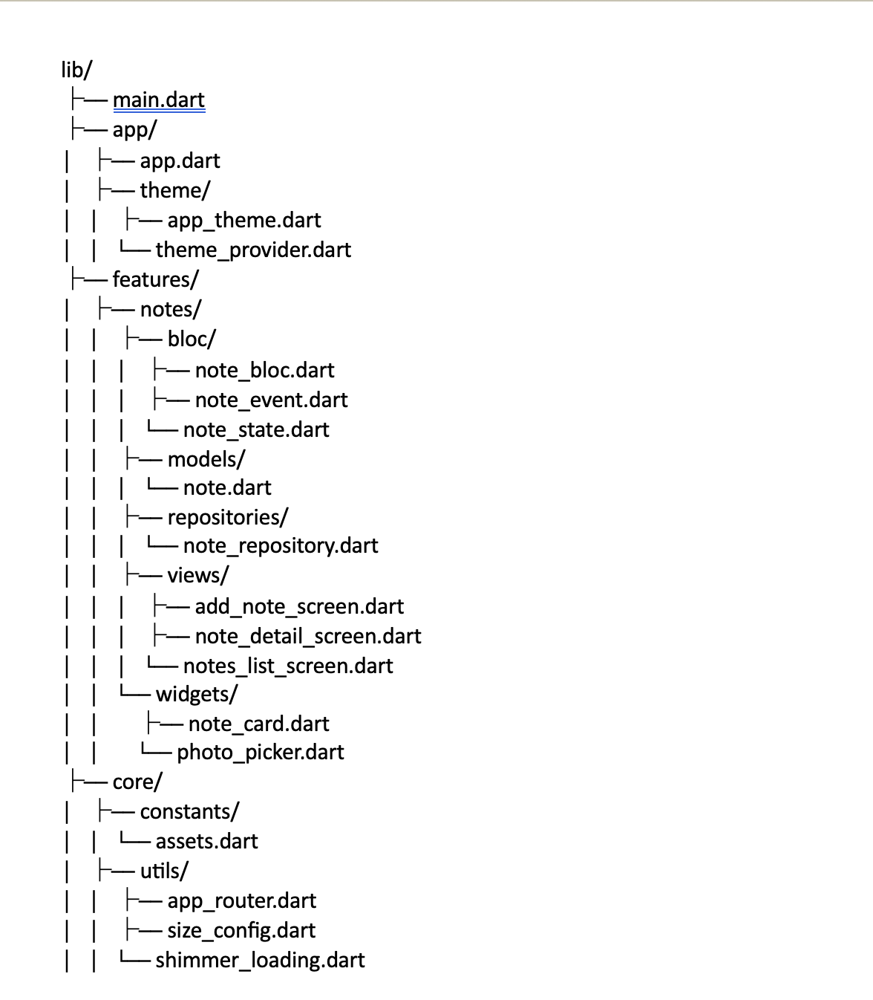

# Dog Journal 🐶

# Заметки для собак 🐶

Простое мобильное приложение для хранения важной информации о вашем питомце.



## Возможности
✔️ Создание заметок с категориями (здоровье, питание, тренировки)  
✔️ Напоминания о важных событиях (прививки, визиты к ветеринару)  
✔️ Хранение медицинских данных и рецептов  
✔️ Возможность добавления фото питомца  


## Скриншоты






## Структура проекта
- lib/
- ├── main.dart
- ├── app/
- │   ├── app.dart
- │   ├── theme/
- │   │   ├── app_theme.dart
- │   │   └── theme_provider.dart
- ├── features/
- │   ├── notes/
- │   │   ├── bloc/
- │   │   │   ├── note_bloc.dart
- │   │   │   ├── note_event.dart
- │   │   │   └── note_state.dart
- │   │   ├── models/
- │   │   │   └── note.dart
- │   │   ├── repositories/
- │   │   │   └── note_repository.dart
- │   │   ├── views/
- │   │   │   ├── add_note_screen.dart
- │   │   │   ├── note_detail_screen.dart
- │   │   │   └── notes_list_screen.dart
- │   │   └── widgets/
- │   │       ├── note_card.dart
- │   │       └── photo_picker.dart
- ├── core/
- │   ├── constants/
- │   │   └── assets.dart
- │   ├── utils/
- │   │   ├── app_router.dart
- │   │   ├── size_config.dart
- │   │   └── shimmer_loading.dart



🛠 Разработка

##Технологии

Flutter - кросс-платформенный фреймворк
- Hive - локальное хранилище данных
- BLoC - управление состоянием
- image_picker
### Требования
- Flutter 3.0+
- Android SDK / Xcode

### Шаги установки
```bash
# 1. Клонировать репозиторий
git clone git@github.com:muhammadmajd/Dog_Journal.git

# 2. Перейти в директорию проекта
cd dog-notes

# 3. Установить зависимости
flutter pub get

# 4. Запустить приложение
flutter run