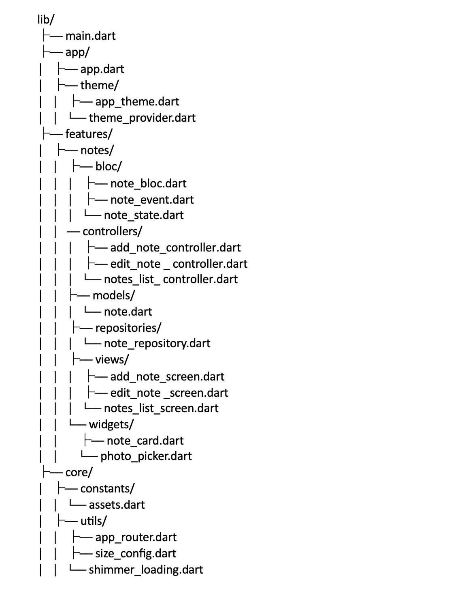

# Dog Journal 🐶

# Заметки для собак 🐶

Простое мобильное приложение для хранения важной информации о вашем питомце.


## Возможности
✔️ Создание заметок с категориями (здоровье, питание, тренировки)  
✔️ Напоминания о важных событиях (прививки, визиты к ветеринару)  
✔️ Хранение медицинских данных и рецептов  
✔️ Возможность добавления фото питомца  


## Скриншоты


## Структура проекта


🛠 Разработка

##Технологии

Flutter - кросс-платформенный фреймворк
- Hive - локальное хранилище данных
- BLoC - управление состоянием
- image_picker
-   build_runner: ^2.4.4
-   test: ^1.24.0
-   bloc_test: ^9.1.0
-    mocktail: ^1.0.3
-   sizer: ^3.0.5
-   hive_test: ^1.0.1
### Требования
- Flutter 3.0+
- Android SDK / Xcode
###  Контакты:
📧 eng.muhammadaliah@gmail.com
💬 @mailiah321

### Шаги установки
```bash
# 1. Клонировать репозиторий
git clone git@github.com:muhammadmajd/Dog_Journal.git

# 2. Перейти в директорию проекта
cd dog-notes

# 3. Установить зависимости
flutter pub get

# 4. Запустить приложение
flutter run

